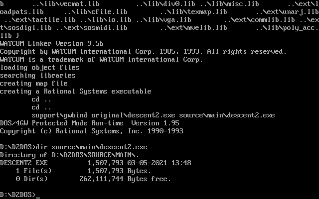

# Build Descent 2 for DOS

This repo contains makefiles and support files that allow you to build Descent 2 for DOS. It contains a binextr utility that extracts the necessary external libraries from an existing descent2.exe. It also contains a few patches to the source code to make it equal to the Descent 2 1.2 Vertigo exe.

The only differences in the resulting exe are different uninitialized padding bytes between strings and a different order for the relocation metadata.

You'll need Watcom 9.5b, MASM 6.11, the Descent 2 1.2 Vertigo exe and a DOS environment, for example DOSBox.

The Descent 2 exe must be copied to the `original` directory.

Start compilation with `wmake` in the top directory.

